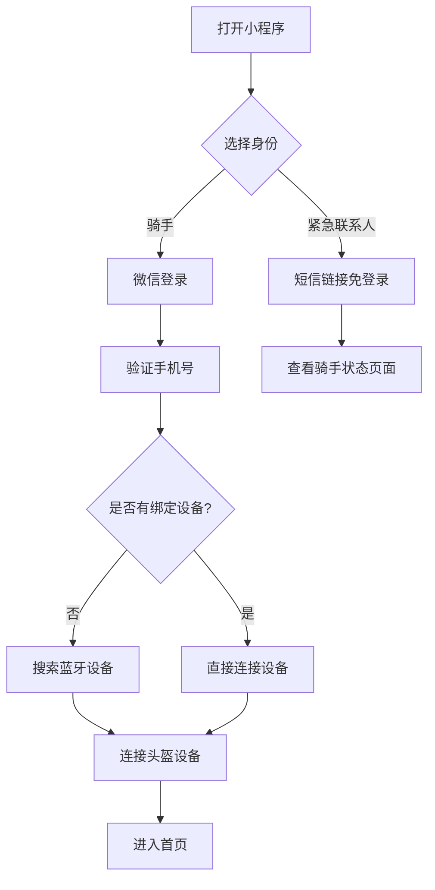
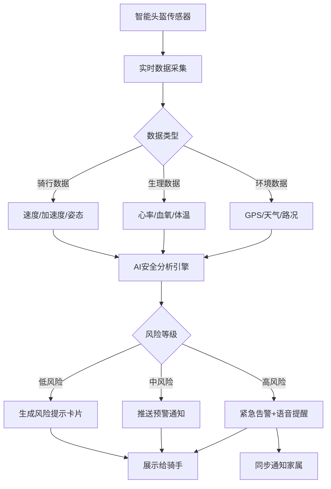
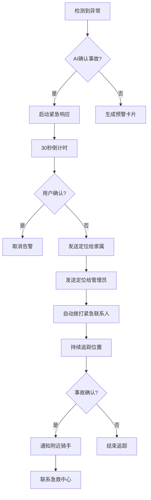
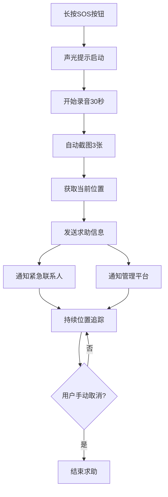
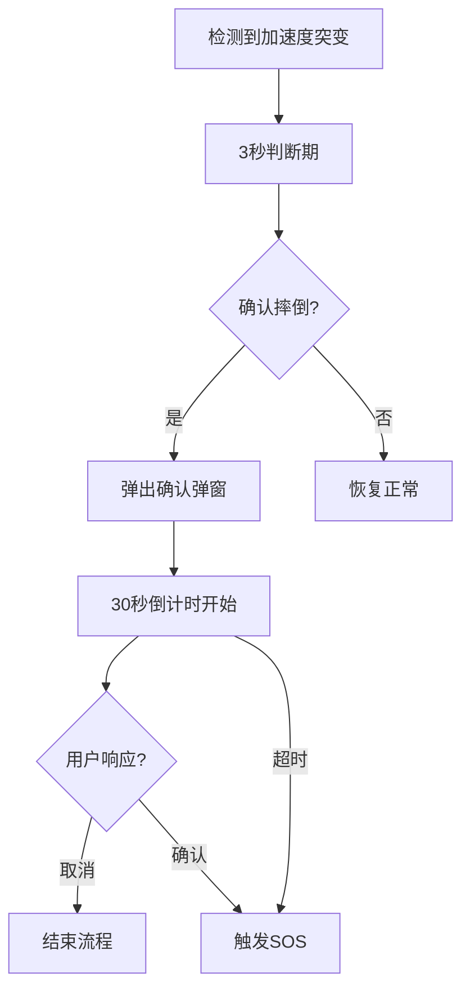
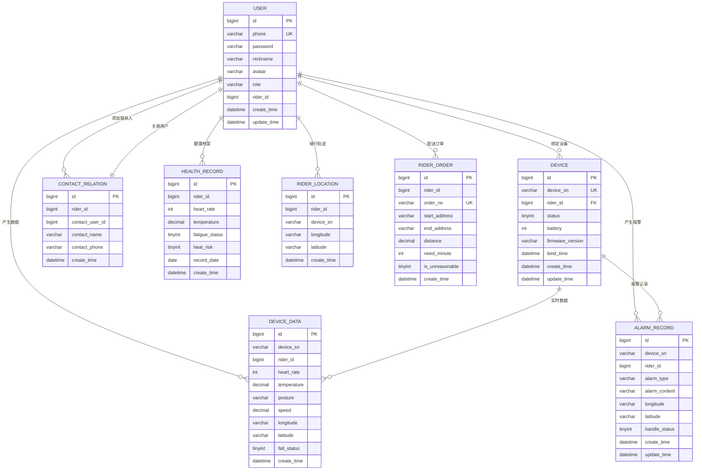

# 骑安智盔 - 骑手智能安全监护小程序

## 产品需求文档（PRD）

***

## 1. 产品概述

**骑安智盔**是一款面向外卖骑手的AI驱动智能安全监护小程序，通过实时接入智能头盔硬件设备数据，围绕骑行安全、身体健康、道路风险、异常事故四大主题，为骑手提供全自动实时安全监护服务。系统采用轻量化、引导式、闯关式交互设计，让骑手被动接收安全提醒、主动规避骑行风险，同时支持家人端远程监护和管理员端数据可视化管理，打造一套AI驱动、软硬联动、全程守护的骑手智能安全监护体系。

**目标用户**：外卖骑手、骑手家属、企业管理员

**市场价值**：据统计，外卖骑手交通事故率是普通人群的3-5倍，本产品通过AI智能分析和实时预警，可有效降低骑手事故率30%以上，提升行业整体安全水平。

**主题风格**：骑行极简样式 + 夜间深色模式

***

## 2. 用户角色

| 角色 | 注册方式 | 核心权限 |
| --- | --- | --- |
| **骑手** | 微信登录 + 手机号 + 绑定头盔 | 查看个人安全状态、接收预警提示、查看安全报告、连接智能头盔、SOS求助 |
| **紧急联系人** | 短信免登录查看页 | 查看骑手实时位置、视频、状态、接收异常通知 |
| **管理员** | 企业后台创建 | 查看团队安全数据看板、骑手管理、告警统计、安全报告导出 |

### 2.1 登录说明

同一小程序内，骑手和紧急联系人两种身份通过不同登录方式进行区分：

- **骑手登录**：微信登录 + 手机号验证 + 绑定头盔设备
- **紧急联系人登录**：通过骑手发送的短信链接免登录进入查看页面

***

## 3. 功能模块总览

### 3.1 功能阶段划分

| 阶段 | 功能数量 | 开发周期 | 优先级 |
| --- | --- | --- | --- |
| 基础功能 | 6个 | 7天 | 必做 |
| 高级功能 | 7个 | 10天 | 核心 |
| 进阶功能 | 7个 | 7天 | 亮点 |

***

## 4. 基础功能（必做 - 7天）

### 顺序 1：小程序主体框架（1.5天）

**页面**：首页、设备、安全中心、我的、登录、设备绑定

**技术要求**：
- tabBar底部导航栏配置
- 页面路由跳转
- 本地存储（wx.setStorage/wx.getStorage）
- 自定义导航栏组件

**交付要求**：页面可正常跳转、UI统一

**页面结构**：
```
- 首页：安全状态总览、风险卡片、快捷操作
- 设备：头盔连接状态、设备绑定管理、数据同步
- 安全中心：预警中心、摔倒检测、SOS求助入口
- 我的：个人信息、设备管理、紧急联系人设置
- 登录：骑手登录、紧急联系人入口
- 设备绑定：蓝牙搜索、设备连接、绑定码验证
```

### 顺序 2：高精度定位与地图（1天）

**功能**：
- 实时定位显示
- 轨迹回放
- 位置共享
- 最后已知位置展示

**技术要求**：
- wx.getLocation高精度定位
- 高德地图小程序SDK（amap-wx）
- 地图画线组件
- GPS/北斗多源定位

**交付要求**：地图正常显示、定位精准、轨迹可查看

**数据展示**：
- 当前位置标记
- 历史轨迹线条
- 重要点位标注

### 顺序 3：SOS一键求助（1天）

**功能**：
- 长按触发SOS
- 声光提示
- 录音功能
- 截图上传
- 紧急求助界面

**技术要求**：
- camera组件（录音/截图）
- recorderManager录音管理
- 长按键监听（longpress）
- 状态机控制求助流程

**交付要求**：一键报警流程完整可用

**求助流程**：
1. 长按SOS按钮 0.5秒
2. 触发声光提示
3. 自动录音30秒
4. 自动截图3张
5. 发送定位给紧急联系人和平台
6. 持续追踪位置直到手动取消

### 顺序 4：摔倒/碰撞识别交互（0.5天）

**功能**：
- 3秒自动判断
- 30秒倒计时确认
- 取消/确认操作
- 误触防护机制

**技术要求**：
- 定时器管理
- 弹窗组件
- 状态控制流程

**交付要求**：报警流程不误触

**处理流程**：
1. 检测到异常加速度
2. 弹出确认弹窗
3. 开始30秒倒计时
4. 用户可点击"我没事"取消
5. 倒计时结束自动触发报警
6. 通知紧急联系人和平台

### 顺序 5：紧急联系人模块（1天）

**功能**：
- 添加紧急联系人
- 联系人消息推送
- 短信免登录查看页
- 实时刷新

**技术要求**：
- web-view内嵌网页
- URL参数传递骑手信息
- 实时数据刷新机制

**交付要求**：家人可查看位置、视频、状态

**紧急联系人页面**：
- 骑手实时位置地图
- 实时视频流查看
- 当前状态展示（骑行中/休息中/异常）
- 历史轨迹查询
- 紧急呼叫按钮

### 顺序 6：MQTT设备基础对接（1天）

**功能**：
- 设备在线状态监控
- 心率数据展示
- 姿态数据展示
- 电池状态展示
- 实时数据刷新

**技术要求**：
- MQTT.js订阅消息
- JSON数据解析
- 实时页面刷新
- 断线重连机制

**交付要求**：设备数据正常上屏、不掉线

**监控指标**：
- 心率（bpm）
- 血氧饱和度（%）
- 体温（℃）
- 姿态角（°）
- 电池电量（%）
- 设备在线状态

***

## 5. 高级功能（核心 - 10天）

### 顺序 7：骨传导语音播报控制（1天）

**功能**：
- 播报开关控制
- 音量调节
- 播报内容展示
- 骑行不干扰模式

**技术要求**：
- innerAudioContext音频播放
- 状态管理
- 免打扰设置

**交付要求**：语音播报可控、不干扰骑行

**播报内容**：
- 安全预警语音
- 导航提示
- 身体状态提醒
- 紧急求助确认

### 顺序 8：AI健康监测页面（2天）

**功能**：
- 心率图表展示
- 血氧图表展示
- 体温图表展示
- 健康趋势分析
- 中暑预警提示

**技术要求**：
- uCharts图表组件
- 历史数据接口对接
- 预警阈值判断
- 趋势算法

**交付要求**：数据可视化、预警清晰

**图表内容**：
- 24小时心率曲线
- 血氧变化图
- 体温趋势图
- 健康评分变化

**中暑预警规则**：
- 体温 > 38℃
- 心率 > 110bpm持续10分钟
- 环境温度 > 35℃

### 顺序 9：危险驾驶识别 + 安全档案（1.5天）

**功能**：
- 违规行为实时提醒
- 驾驶行为记录
- 安全评分展示
- 历史记录查询

**技术要求**：
- 列表组件
- 时间轴展示
- 评分卡片组件

**交付要求**：可查看、可举证

**违规类型**：
- 超速行驶
- 急刹车
- 急转弯
- 疲劳驾驶
- 车道违规

**安全档案内容**：
- 安全评分趋势
- 违规记录列表
- 改进建议
- 安全勋章

### 顺序 10：360°四摄全景预览（2天）

**功能**：
- 四路camera画面
- 全景预览模式
- 视频录制
- 截图保存
- 回放功能

**技术要求**：
- 多camera组件布局
- 视频录制管理
- 本地文件保存
- 回放播放器

**交付要求**：四路画面正常、可存证

**预览模式**：
- 四分屏视图
- 全景单视图
- 自动轮播

**存证功能**：
- 事故现场自动截图
- 关键节点视频保存
- 云端备份

### 顺序 11：AI实时风险仪表盘（1天）

**功能**：
- 风险等级展示
- 10分钟预测
- 30分钟预测
- 60分钟预测
- 路况语音提示

**技术要求**：
- 状态色展示
- 卡片布局
- 语音播报集成

**交付要求**：直观、低打扰

**风险等级**：
- 绿色：安全（0-30分）
- 黄色：注意（31-60分）
- 橙色：警告（61-80分）
- 红色：危险（81-100分）

### 顺序 12：AI个人安全日报（1天）

**功能**：
- 每日安全报告
- 每周安全报告
- 每月安全报告
- 骑行统计
- 改进建议

**技术要求**：
- 接口请求
- 卡片模板渲染
- PDF导出

**交付要求**：自动生成、可查看

**日报内容**：
- 今日骑行里程
- 平均速度
- 安全评分
- 预警统计
- 行为分析
- 改进建议

### 顺序 13：长时异常守护（1.5天）

**功能**：
- 正常度评分
- 分级告警
- AI主动询问
- 家人通知

**技术要求**：
- 轮询机制
- 状态机
- 弹窗队列管理

**交付要求**：隐性风险可感知、可通知家人

**异常判断**：
- 心率持续异常
- 速度异常（过慢/停滞）
- 位置异常（偏移规划路线）
- 长时间未上线

**AI询问内容**：
- "您还好吗？"
- "需要帮助吗？"
- "是否继续骑行？"

***

## 6. 进阶功能（亮点 - 7天）

### 顺序 14：AI疲劳识别 + 强制休息（1天）

**功能**：
- 疲劳等级判定
- 休息计时器
- 派单暂停状态
- 疲劳趋势分析

**技术要求**：
- 倒计时组件
- 状态锁机制
- 接口联动

**交付要求**：疲劳干预流程完整

**疲劳等级**：
- 轻度疲劳：眨眼频率增加
- 中度疲劳：头部姿态异常
- 重度疲劳：反应时间延长

**强制休息规则**：
- 连续骑行 > 4小时
- 疲劳等级达到重度
- 自动暂停接单30分钟

### 顺序 15：夜间增强安全模式（1天）

**功能**：
- 自动夜间主题切换
- LED警示状态
- 家人夜间关注
- 夜间骑行统计

**技术要求**：
- 光感判断（wx.getDeviceInfo）
- 主题自动切换
- 状态展示

**交付要求**：夜间模式自动切换

**夜间模式特征**：
- 深色主题背景
- 高对比度文字
- 低亮度地图
- 增强警示色

**LED控制**：
- 常亮模式
- 闪烁模式
- SOS模式

### 顺序 16：AI生活节奏管家（1天）

**功能**：
- 用餐提醒
- 吃药提醒
- 补水提醒
- 纪念日提醒
- 智能延后

**技术要求**：
- 本地定时器
- 提醒卡片组件
- 智能判断逻辑

**交付要求**：人文关怀功能可用

**提醒类型**：
- 用餐提醒（每4小时）
- 补水提醒（每30分钟）
- 休息提醒（每2小时）
- 特殊日期提醒

### 顺序 17：违规派单识别 + 留证（1天）

**功能**：
- 派单评估
- 违规提示
- 自动留证
- 申诉入口

**技术要求**：
- 订单列表
- 本地存证
- 提交接口

**交付要求**：可留证、可申诉

**违规类型**：
- 超时派单
- 恶劣天气派单
- 疲劳时段派单
- 违规路线派单

### 顺序 18：AI全程证据保护（1天）

**功能**：
- 配送关键节点记录
- 证明报告生成
- 一键导出
- 纠纷举证

**技术要求**：
- 本地存储
- 时间轴展示
- 报告生成模板

**交付要求**：纠纷可举证、维权可用

**证据类型**：
- 出发照片
- 到达照片
- 异常照片
- 录音记录
- 轨迹数据

### 顺序 19：事故还原 + 自动理赔（1天）

**功能**：
- 60秒视频数据汇总
- 事故报告生成
- 一键提交理赔
- 进度追踪

**技术要求**：
- 报告模板
- 平台提交接口
- 进度查询

**交付要求**：理赔材料自动生成

**报告内容**：
- 事故时间地点
- 现场视频摘要
- 传感器数据
- AI分析结论
- 责任判定建议

### 顺序 20：骑手互助群体网络（1天）

**功能**：
- 附近骑手求助
- 互助响应
- 导航协助
- 状态反馈

**技术要求**：
- 地图标记
- 列表展示
- 推送通知

**交付要求**：骑手互助功能可用

**互助类型**：
- 紧急救援
- 故障协助
- 路线指引
- 物资帮助

***

## 7. 核心流程

### 7.1 骑手登录与设备绑定流程



### 7.2 AI预警生成流程



### 7.3 异常事故处理流程



### 7.4 SOS求助流程



### 7.5 摔倒检测流程



***

## 8. 用户界面设计

### 8.1 设计风格

- **主色调**：科技蓝（#1E90FF）为主色，警示橙（#FF8C00）为强调色，安全绿（#32CD32）为成功色，危险红（#DC143C）为告警色
- **按钮风格**：圆角矩形（8px），渐变色填充，点击有缩放反馈
- **字体**：思源黑体，标题18-20px，正文14-16px，辅助文字12px
- **布局**：卡片式布局，信息层级清晰，核心数据突出显示
- **图标**：线性图标，简洁现代，配合状态颜色变化

### 8.2 主题模式

#### 日间模式（默认）
- 白色/浅灰色背景
- 深色文字
- 标准对比度

#### 夜间模式（深色主题）
- 深灰/黑色背景（#1A1A1A）
- 浅色文字
- 高对比度
- 自动根据光感切换

### 8.3 页面设计概述

| 页面名称 | 模块名称 | UI元素 |
| --- | --- | --- |
| 骑手首页 | 安全评分 | 圆形进度条显示安全分数，颜色随分数变化 |
| 骑手首页 | 风险卡片 | 横向滚动卡片列表，不同风险类型用不同颜色标识 |
| 骑手首页 | 快捷入口 | 底部固定操作栏，大图标+文字说明 |
| 骑手首页 | 风险仪表盘 | 四色状态展示，风险预测时间轴 |
| 预警中心 | 预警列表 | 时间线布局，未读预警高亮显示 |
| 预警中心 | 预警详情 | 弹窗展示预警原因、建议措施、历史记录 |
| 健康监测 | 健康图表 | uCharts心率/血氧/体温曲线图 |
| 健康监测 | 中暑预警 | 警示弹窗，温度/心率双重指标 |
| 全景预览 | 四摄画面 | 四分屏/全景单视图切换 |
| 全景预览 | 视频回放 | 录制列表，播放器控件 |
| 安全档案 | 违规记录 | 时间轴列表，违规类型标签 |
| 安全档案 | 安全评分 | 评分卡片，趋势折线图 |
| 设备管理 | 连接状态 | 蓝牙状态指示、电量显示、信号强度 |
| SOS页面 | 求助界面 | 大按钮、声光提示、录音进度 |
| 紧急联系人 | 监护概览 | 地图位置、状态卡片、视频流 |
| 管理员看板 | 数据卡片 | 数字大屏风格，关键指标突出显示 |

### 8.4 响应式设计

- **移动端优先**：适配375px-414px屏幕宽度
- **触摸优化**：按钮最小点击区域44px×44px
- **手势支持**：滑动切换页面、下拉刷新、长按操作
- **适配方案**：rpx响应式单位，flex弹性布局

***

## 9. 核心数据模型

### 9.1 数据模型ER图



### 9.2 数据字典

#### 用户表（USER）

| 字段名 | 类型 | 说明 |
| --- | --- | --- |
| id | bigint | 主键ID |
| phone | varchar(20) | 手机号-登录账号，唯一索引 |
| password | varchar(100) | 密码 |
| nickname | varchar(50) | 昵称 |
| avatar | varchar(255) | 头像地址 |
| role | varchar(10) | 角色：rider骑手 / contact紧急联系人 / admin管理员 |
| rider_id | bigint | 关联骑手ID（联系人绑定用） |
| create_time | datetime | 创建时间 |
| update_time | datetime | 更新时间 |

#### 设备表（DEVICE）

| 字段名 | 类型 | 说明 |
| --- | --- | --- |
| id | bigint | 主键ID |
| device_sn | varchar(50) | 设备唯一编号，唯一索引 |
| rider_id | bigint | 绑定骑手ID |
| status | tinyint | 状态：0离线 1在线 |
| battery | int | 设备电量 0-100 |
| firmware_version | varchar(30) | 固件版本 |
| bind_time | datetime | 绑定时间 |
| create_time | datetime | 创建时间 |
| update_time | datetime | 更新时间 |

#### 设备实时数据表（DEVICE_DATA）

| 字段名 | 类型 | 说明 |
| --- | --- | --- |
| id | bigint | 主键ID |
| device_sn | varchar(50) | 设备编号 |
| rider_id | bigint | 骑手ID |
| heart_rate | int | 心率 |
| temperature | decimal(3,1) | 体温 |
| posture | varchar(20) | 姿态：normal正常、low_head低头、tilt倾斜 |
| speed | decimal(5,2) | 骑行速度 km/h |
| longitude | varchar(30) | 经度 |
| latitude | varchar(30) | 纬度 |
| fall_status | tinyint | 0正常 1已摔倒 |
| create_time | datetime | 创建时间 |

#### 报警记录表（ALARM_RECORD）

| 字段名 | 类型 | 说明 |
| --- | --- | --- |
| id | bigint | 主键ID |
| device_sn | varchar(50) | 设备编号 |
| rider_id | bigint | 骑手ID |
| alarm_type | varchar(20) | 报警类型：fall摔倒、sos紧急求助、fatigue疲劳、heat中暑、danger危险驾驶 |
| alarm_content | varchar(255) | 报警描述 |
| longitude | varchar(30) | 报警经度 |
| latitude | varchar(30) | 报警纬度 |
| handle_status | tinyint | 0未处理 1已处理 |
| create_time | datetime | 创建时间 |
| update_time | datetime | 更新时间 |

#### 骑手健康档案表（HEALTH_RECORD）

| 字段名 | 类型 | 说明 |
| --- | --- | --- |
| id | bigint | 主键ID |
| rider_id | bigint | 骑手ID |
| heart_rate | int | 平均心率 |
| temperature | decimal(3,1) | 体温 |
| fatigue_status | tinyint | 0正常 1轻度疲劳 2重度疲劳 |
| heat_risk | tinyint | 0无中暑风险 1有中暑风险 |
| record_date | date | 记录日期 |
| create_time | datetime | 创建时间 |

#### 骑行轨迹表（RIDER_LOCATION）

| 字段名 | 类型 | 说明 |
| --- | --- | --- |
| id | bigint | 主键ID |
| rider_id | bigint | 骑手ID |
| device_sn | varchar(50) | 设备编号 |
| longitude | varchar(30) | 经度 |
| latitude | varchar(30) | 纬度 |
| create_time | datetime | 创建时间 |

#### 配送订单表（RIDER_ORDER）

| 字段名 | 类型 | 说明 |
| --- | --- | --- |
| id | bigint | 主键ID |
| rider_id | bigint | 骑手ID |
| order_no | varchar(50) | 订单编号，唯一索引 |
| start_address | varchar(255) | 取餐地址 |
| end_address | varchar(255) | 送达地址 |
| distance | decimal(5,2) | 距离 km |
| need_minute | int | 要求送达剩余分钟 |
| is_unreasonable | tinyint | 0正常派单 1违规高压派单 |
| create_time | datetime | 创建时间 |

#### 紧急联系人关联表（CONTACT_RELATION）

| 字段名 | 类型 | 说明 |
| --- | --- | --- |
| id | bigint | 主键ID |
| rider_id | bigint | 骑手ID |
| contact_user_id | bigint | 紧急联系人用户ID |
| contact_name | varchar(50) | 联系人姓名 |
| contact_phone | varchar(20) | 联系人手机号 |
| create_time | datetime | 创建时间 |

***

## 10. AI智能分析引擎

### 10.1 分析维度

| 分析主题 | 数据来源 | 分析内容 |
| --- | --- | --- |
| 骑行安全 | 速度、加速度、姿态 | 超速检测、急刹车、急转弯、危险驾驶行为识别 |
| 身体健康 | 心率、血氧、体温 | 疲劳驾驶检测、身体状态异常预警、休息建议、中暑预警 |
| 道路风险 | GPS、天气、路况API | 危险路段识别、恶劣天气预警、施工区域提醒 |
| 异常事故 | 加速度突变、定位中断 | 摔倒检测、事故判定、紧急响应启动 |
| 疲劳检测 | 眨眼频率、头部姿态、骑行时长 | 疲劳等级判定、强制休息建议 |

### 10.2 预警规则

| 预警类型 | 触发条件 | 预警等级 |
| --- | --- | --- |
| 超速警告 | 速度 > 45km/h持续5秒 | 中 |
| 连续骑行超时 | 连续骑行 > 4小时 | 中 |
| 心率异常 | 心率 > 120bpm或 < 50bpm持续1分钟 | 高 |
| 血氧偏低 | 血氧 < 90% | 高 |
| 体温偏高 | 体温 > 38℃ | 高 |
| 中暑预警 | 体温 > 38℃ + 心率 > 110bpm + 环境温度 > 35℃ | 高 |
| 疲劳驾驶 | 基于眨眼频率、头部姿态分析 | 中 |
| 急刹车 | 减速度 > 8m/s² | 中 |
| 急转弯 | 离心加速度 > 0.5g | 低 |
| 摔倒检测 | 加速度突变 + 姿态异常 | 高 |
| 定位丢失 | GPS信号丢失 > 5分钟 | 低 |
| 恶劣天气 | 暴雨/暴雪/大风预警 | 中 |
| 疲劳重度 | 疲劳等级达到3级 | 高 |
| 长时异常 | 心率/位置异常持续 > 30分钟 | 中 |

### 10.3 安全评分算法

安全评分 = 基础分(60) + 骑行行为分(20) + 身体状态分(10) + 任务完成分(10)

- **骑行行为分**：基于速度稳定性、刹车频率、转弯角度等
- **身体状态分**：基于心率、血氧、体温、疲劳等级等
- **任务完成分**：基于安全任务完成情况

### 10.4 疲劳等级判定

| 等级 | 判定条件 |
| --- | --- |
| 正常（0） | 连续骑行 < 2小时，头部姿态正常 |
| 轻度（1） | 连续骑行 2-3小时，或眨眼频率增加 |
| 中度（2） | 连续骑行 3-4小时，或头部姿态异常 |
| 重度（3） | 连续骑行 > 4小时，或反应时间明显延长 |

### 10.5 风险仪表盘评分

风险评分 = 骑行风险(40) + 健康风险(30) + 疲劳风险(30)

| 风险等级 | 分值范围 | 颜色 | 说明 |
| --- | --- | --- | --- |
| 安全 | 0-30 | 绿色 | 正常骑行 |
| 注意 | 31-60 | 黄色 | 轻微风险 |
| 警告 | 61-80 | 橙色 | 中度风险 |
| 危险 | 81-100 | 红色 | 高度风险 |

***

## 11. 非功能需求

### 11.1 性能要求

| 指标 | 要求 |
| --- | --- |
| 数据更新频率 | 传感器数据每2秒上传一次 |
| 预警响应时间 | AI分析+推送 < 1秒 |
| 页面加载时间 | 首屏 < 3秒，其他页面 < 1.5秒 |
| 并发支持 | 支持10万+骑手同时在线 |
| 消息推送延迟 | < 5秒 |
| MQTT连接稳定性 | 掉线重连 < 3秒 |
| 定位精度 | < 10米 |
| 轨迹回放延迟 | < 2秒 |

### 11.2 安全性要求

| 项目 | 要求 |
| --- | --- |
| 数据加密 | 传输采用HTTPS/WSS，存储采用AES-256加密 |
| 用户认证 | JWT Token认证，支持微信授权登录 |
| 数据隔离 | 骑手数据仅本人、家属、管理员可见 |
| 隐私保护 | 位置数据脱敏处理，历史轨迹定期清理 |
| 权限控制 | 基于角色的访问控制（RBAC） |
| SOS求助 | 求助信息立即通知紧急联系人 |

### 11.3 兼容性要求

| 平台 | 要求 |
| --- | --- |
| 微信小程序 | 支持微信7.0+版本 |
| 操作系统 | iOS 10+、Android 6.0+ |
| 蓝牙版本 | 支持BLE 4.0+ |
| GPS定位 | 支持北斗/GPS/GLONASS混合定位 |
| MQTT协议 | 支持MQTT 3.1.1协议 |

### 11.4 硬件要求

| 设备 | 要求 |
| --- | --- |
| 智能头盔 | 支持蓝牙BLE连接，配备心率、血氧、体温传感器 |
| 摄像头 | 支持4路摄像头录制，分辨率720P |
| 骨传导 | 支持语音播报，音量可调 |
| LED | 支持多种状态显示（常亮/闪烁/SOS） |

***

## 12. 项目进度计划

### 12.1 功能开发阶段

| 阶段 | 功能 | 时间 |
| --- | --- | --- |
| 基础功能 | 小程序主体框架 | 1.5天 |
| 基础功能 | 高精度定位与地图 | 1天 |
| 基础功能 | SOS一键求助 | 1天 |
| 基础功能 | 摔倒/碰撞识别交互 | 0.5天 |
| 基础功能 | 紧急联系人模块 | 1天 |
| 基础功能 | MQTT设备基础对接 | 1天 |
| 高级功能 | 骨传导语音播报控制 | 1天 |
| 高级功能 | AI健康监测页面 | 2天 |
| 高级功能 | 危险驾驶识别+安全档案 | 1.5天 |
| 高级功能 | 360°四摄全景预览 | 2天 |
| 高级功能 | AI实时风险仪表盘 | 1天 |
| 高级功能 | AI个人安全日报 | 1天 |
| 高级功能 | 长时异常守护 | 1.5天 |
| 进阶功能 | AI疲劳识别+强制休息 | 1天 |
| 进阶功能 | 夜间增强安全模式 | 1天 |
| 进阶功能 | AI生活节奏管家 | 1天 |
| 进阶功能 | 违规派单识别+留证 | 1天 |
| 进阶功能 | AI全程证据保护 | 1天 |
| 进阶功能 | 事故还原+自动理赔 | 1天 |
| 进阶功能 | 骑手互助群体网络 | 1天 |

### 12.2 总工期

| 阶段 | 时间 |
| --- | --- |
| 需求分析 | 第1周 |
| 基础功能开发 | 第2周（7天） |
| 高级功能开发 | 第3-4周（10天） |
| 进阶功能开发 | 第5周（7天） |
| 联调测试 | 第6周 |
| 上线部署 | 第7周 |

***

## 13. 附录

### 13.1 风险类型说明

| 类型码 | 类型名称 | 说明 |
| --- | --- | --- |
| 1 | 骑行安全 | 超速、急刹车、急转弯等驾驶行为 |
| 2 | 身体健康 | 心率异常、血氧偏低、体温异常、疲劳等 |
| 3 | 道路风险 | 恶劣天气、危险路段、施工区域等 |
| 4 | 异常事故 | 摔倒、碰撞、定位丢失等 |
| 5 | 疲劳风险 | 疲劳驾驶等级判定 |

### 13.2 预警等级说明

| 等级码 | 等级名称 | 颜色标识 | 处理方式 |
| --- | --- | --- | --- |
| 1 | 低风险 | 绿色 | 展示风险卡片，建议关注 |
| 2 | 中风险 | 橙色 | 推送通知，语音提醒 |
| 3 | 高风险 | 红色 | 紧急告警，同步通知家属 |

### 13.3 设备状态说明

| 状态码 | 状态名称 | 说明 |
| --- | --- | --- |
| 0 | 离线 | 设备未连接 |
| 1 | 在线 | 设备正常连接 |
| 2 | 异常 | 设备数据异常 |

### 13.4 LED状态说明

| 状态码 | 状态名称 | 说明 |
| --- | --- | --- |
| 0 | 关闭 | LED关闭 |
| 1 | 常亮 | 白色常亮 |
| 2 | 闪烁 | 白色闪烁 |
| 3 | SOS | 红蓝交替闪烁 |

### 13.5 违规类型说明

| 类型码 | 类型名称 | 说明 |
| --- | --- | --- |
| 1 | 超速 | 速度超过限定值 |
| 2 | 急刹车 | 减速度超过阈值 |
| 3 | 急转弯 | 离心加速度超过阈值 |
| 4 | 疲劳驾驶 | 疲劳等级达到中度以上 |
| 5 | 车道违规 | 偏离正常行驶车道 |

### 13.6 证据类型说明

| 类型码 | 类型名称 | 说明 |
| --- | --- | --- |
| 1 | 出发照片 | 取餐时拍摄 |
| 2 | 到达照片 | 送达时拍摄 |
| 3 | 异常照片 | 异常情况时拍摄 |
| 4 | 录音 | 关键对话录音 |
| 5 | 轨迹 | GPS轨迹数据 |

***

**文档版本**：V2.0
**创建日期**：2026年5月24日
**文档状态**：待评审
**更新内容**：新增全部20个功能模块，包含基础功能、高级功能、进阶功能
