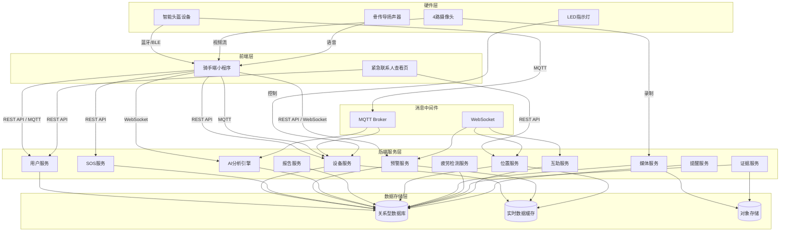
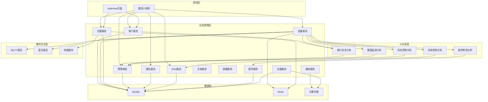
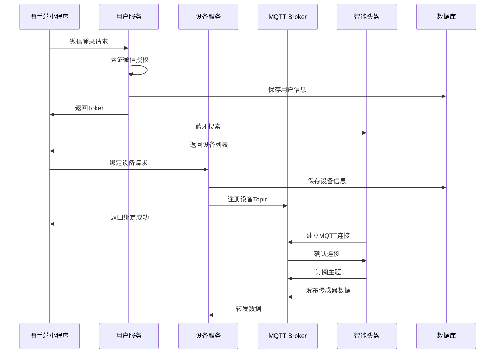
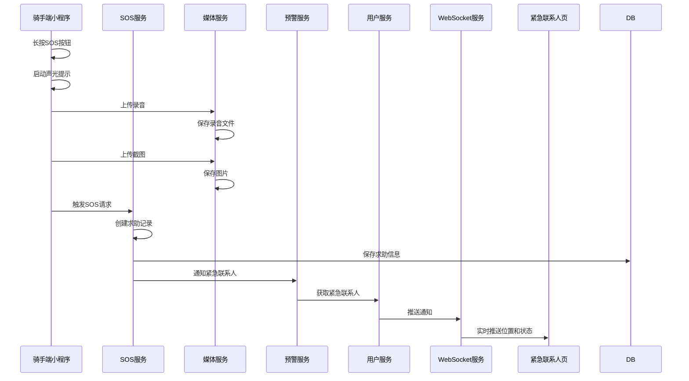
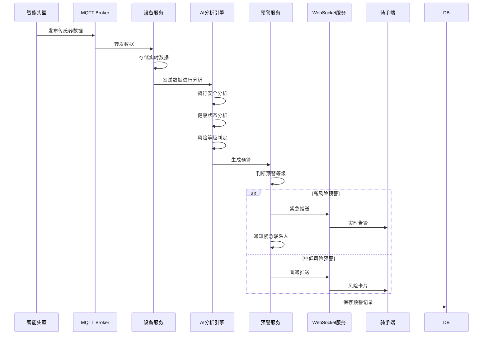
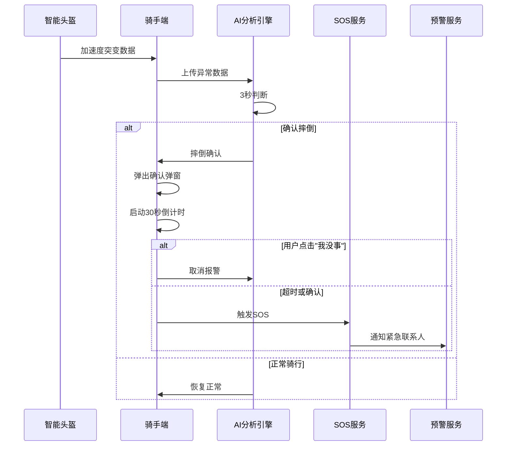
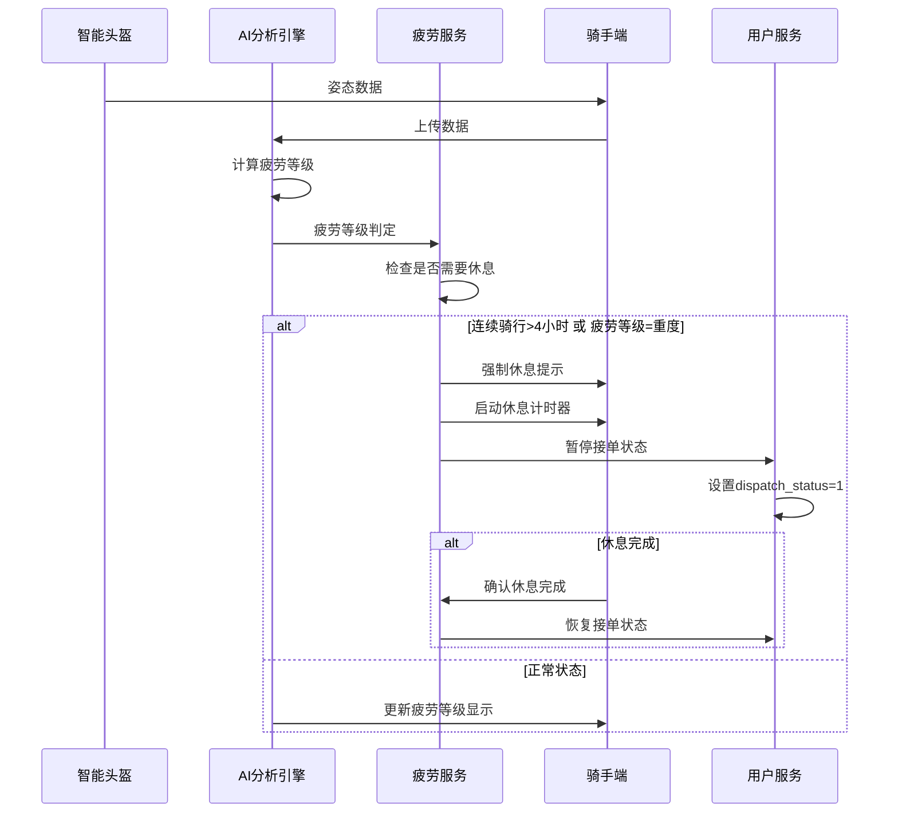
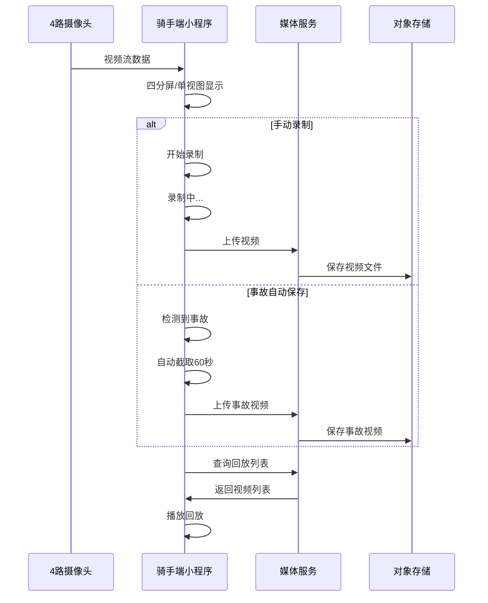
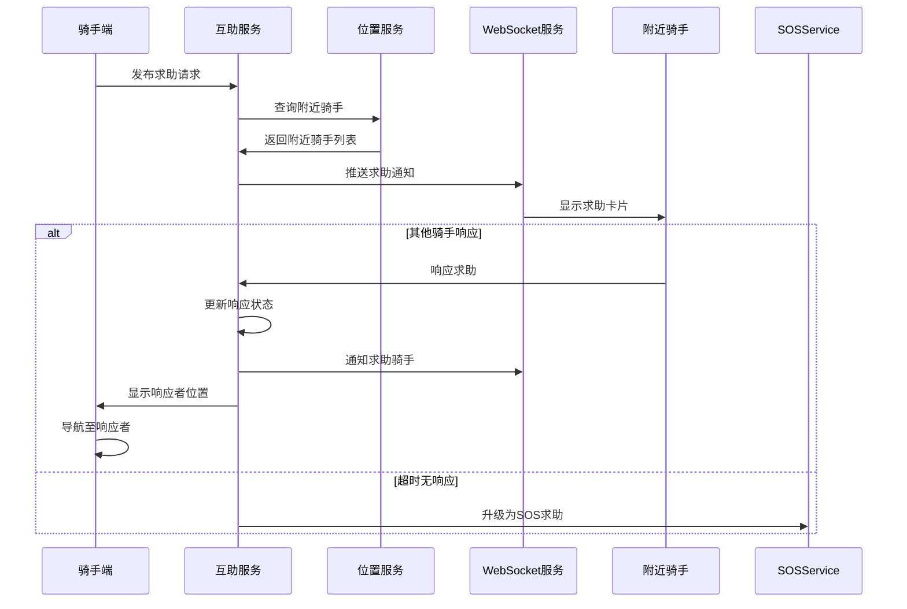

# 骑安智盔 - 技术架构文档

***

## 1. 系统总体架构

### 1.1 架构设计原则

- **前后端分离**：前端与后端完全解耦，通过 RESTful API 和 MQTT 进行数据交互
- **最小化原则**：仅包含满足核心功能需求的技术组件
- **可扩展性**：在满足功能需求的前提下预留基本扩展空间
- **身份分离**：同一小程序支持骑手和紧急联系人两种身份

### 1.2 系统架构图



### 1.3 技术架构分层



***

## 2. 核心模块划分

### 2.1 前端模块

#### 骑手端小程序

**基础功能模块（1-6）**：
- 首页模块：安全状态总览、风险卡片、快捷操作
- 设备模块：蓝牙连接、数据同步、设备状态监控
- 安全中心模块：预警中心、摔倒检测、SOS入口
- 地图模块：实时定位、轨迹回放、位置共享
- 登录模块：微信登录、手机号绑定、身份选择
- 设备绑定模块：蓝牙搜索、设备连接

**高级功能模块（7-13）**：
- 语音播报模块：骨传导语音控制、音量调节、免打扰
- 健康监测模块：心率/血氧/体温图表、中暑预警
- 安全档案模块：违规记录、安全评分、趋势分析
- 全景预览模块：四摄画面、视频录制、截图保存、回放
- 风险仪表盘模块：风险等级、预测展示、语音提示
- 安全报告模块：日报/周报/月报、骑行统计、改进建议
- 长时守护模块：异常检测、AI询问、家人通知

**进阶功能模块（14-20）**：
- 疲劳管理模块：疲劳等级判定、休息计时、派单暂停
- 夜间模式模块：自动主题切换、LED控制、家人夜间关注
- 生活管家模块：用餐/补水/休息提醒、智能延后
- 违规派单模块：派单评估、违规提示、申诉入口
- 证据保护模块：关键节点记录、证明报告、一键导出
- 事故理赔模块：事故还原、报告生成、理赔提交
- 互助网络模块：附近骑手求助、响应、导航

#### 紧急联系人查看页

- 监护概览模块：实时位置地图、骑手状态卡片
- 视频流模块：实时视频查看
- 历史轨迹模块：当日行驶轨迹查询
- 紧急呼叫模块：一键呼叫骑手

### 2.2 后端模块

| 服务名称 | 功能职责 | 关联功能 |
| --- | --- | --- |
| 用户服务 | 用户注册/登录、身份管理、紧急联系人管理 | 登录、紧急联系人模块 |
| 设备服务 | 设备绑定/解绑、MQTT通信、设备状态管理 | MQTT对接、设备管理、LED控制 |
| 位置服务 | 实时位置更新、历史轨迹存储、位置共享 | 定位地图、轨迹回放、互助网络 |
| SOS服务 | SOS求助处理、媒体文件管理、紧急通知 | SOS求助、摔倒检测 |
| 预警服务 | 预警生成、推送管理、预警历史 | 预警中心、风险仪表盘 |
| 报告服务 | 日报/周报/月报生成、趋势分析 | 安全日报、安全档案 |
| 媒体服务 | 视频录制管理、图片存储、录音管理 | 四摄全景、证据保护 |
| 疲劳服务 | 疲劳检测、强制休息管理、派单状态 | 疲劳识别、夜间模式 |
| 证据服务 | 证据记录、报告生成、申诉管理 | 违规派单、证据保护 |
| 互助服务 | 附近骑手查询、互助请求、状态管理 | 骑手互助网络 |
| 提醒服务 | 生活提醒、提醒规则管理 | 生活节奏管家 |
| AI分析服务 | 骑行安全分析、健康监测、风险预测、异常检测 | 支撑所有AI相关功能 |

### 2.3 模块开发优先级

| 优先级 | 模块 | 开发周期 |
| --- | --- | --- |
| P0 | 用户服务、设备服务、位置服务 | 基础功能期 |
| P1 | SOS服务、预警服务、AI分析服务 | 基础功能期 |
| P2 | 报告服务、媒体服务 | 高级功能期 |
| P3 | 疲劳服务、证据服务、互助服务、提醒服务 | 进阶功能期 |

***

## 3. 技术栈选型

### 3.1 前端技术栈

| 技术组件 | 选型 | 选型依据 |
| --- | --- | --- |
| 开发框架 | 微信小程序原生开发 | 需求文档明确要求使用微信小程序 |
| UI组件库 | 微信小程序原生组件 + 自定义组件 | 满足多样化UI需求，支持主题切换 |
| 图表组件 | uCharts | 需求文档明确指定用于健康数据可视化 |
| 地图服务 | 高德地图小程序SDK（amap-wx） | 需求文档明确指定集成高德地图 |
| MQTT通信 | MQTT.js | 需求文档明确要求MQTT设备对接 |
| 蓝牙通信 | 微信小程序蓝牙API | 需求文档要求蓝牙连接智能头盔 |
| 音频播放 | innerAudioContext | 需求文档要求骨传导语音播报控制 |
| 视频组件 | camera组件 | 需求文档要求360°四摄全景预览 |
| 本地存储 | wx.setStorage/wx.getStorage | 需求文档要求本地存储 |
| WebView | web-view组件 | 需求文档要求短信免登录查看页 |

### 3.2 后端技术栈

| 技术组件 | 选型 | 选型依据 |
| --- | --- | --- |
| 开发语言 | Java | 需求文档项目进度计划明确提及SpringBoot后端开发 |
| Web框架 | Spring Boot | 快速开发、内置容器、生态完善 |
| 数据库 | MySQL | 关系型数据存储，支持事务，满足数据模型需求 |
| 缓存 | Redis | 实时数据缓存、高并发支持、MQTT会话管理 |
| 消息队列 | MQTT Broker（EMQ X） | 需求文档明确要求MQTT协议支持 |
| WebSocket | Spring WebSocket | 实时预警推送、位置更新、SOS通知 |
| ORM框架 | MyBatis-Plus | 轻量级、灵活的SQL映射 |
| 对象存储 | MinIO/阿里云OSS | 视频、图片等大文件存储 |
| 规则引擎 | Drools/Spring Rule | 预警规则、疲劳判定规则配置 |

### 3.3 AI分析引擎技术选型

| 技术组件 | 选型 | 选型依据 |
| --- | --- | --- |
| 分析方式 | 基于规则+简单算法实现 | 需求文档明确提供了预警规则和安全评分算法 |
| 规则引擎 | Spring Rule/Drools | 预警规则、疲劳判定规则 |
| 实时计算 | Redis + Lua脚本 | 实时风险评分计算 |
| 趋势分析 | 简单统计方法 | 健康趋势、疲劳趋势分析 |
| 异常检测 | 阈值判断+状态机 | 摔倒检测、事故判定 |

### 3.4 硬件交互技术选型

| 技术组件 | 选型 | 选型依据 |
| --- | --- | --- |
| 设备通信 | MQTT over TLS | 需求文档要求MQTT设备对接 |
| 蓝牙通信 | BLE 4.0+ | 需求文档要求支持BLE 4.0+ |
| 定位服务 | 北斗/GPS/GLONASS混合 | 需求文档要求多源定位 |
| 视频流 | RTMP/HLS | 四摄全景预览实时视频 |

***

## 4. 模块间交互流程

### 4.1 骑手登录与设备绑定流程



### 4.2 SOS求助流程



### 4.3 AI预警生成与推送流程



### 4.4 摔倒检测与处理流程



### 4.5 疲劳检测与强制休息流程



### 4.6 四摄全景录制流程



### 4.7 骑手互助流程



***

## 5. 数据流转路径

### 5.1 传感器数据流转

```
智能头盔 → MQTT Broker → 设备服务 → AI分析引擎 → 预警服务
                              ↓
                         实时数据缓存（Redis）
                              ↓
                       关系型数据库（MySQL）
```

### 5.2 定位数据流转

```
GPS/北斗模块 → 骑手端小程序 → 位置服务 → 实时位置缓存（Redis）
                                            ↓
                               关系型数据库（MySQL） → 紧急联系人查看页
```

### 5.3 SOS求助数据流转

```
SOS触发 → 骑手端 → SOS服务 → 媒体服务（录音/截图） → 对象存储
                    ↓
              预警服务 → WebSocket → 紧急联系人页面
                    ↓
              位置服务 → 持续位置更新 → 紧急联系人页面
```

### 5.4 健康监测数据流转

```
传感器数据 → MQTT → 设备服务 → AI分析引擎 → 健康报告服务
                                    ↓
                             关系型数据库（MySQL）
                                    ↓
                         骑手端小程序（uCharts图表展示）
```

### 5.5 证据保护数据流转

```
摄像头 → 骑手端小程序 → 媒体服务 → 对象存储（OSS/MinIO）
                                  ↓
                           证据服务 → 关系型数据库
                                  ↓
                         事故报告 → 理赔提交接口
```

### 5.6 互助网络数据流转

```
求助发布 → 互助服务 → 位置服务 → WebSocket推送 → 附近骑手
                              ↓
                         响应确认 → 导航指引
```

***

## 6. 接口规范

### 6.1 通用接口规范

- **协议**：HTTPS / WSS
- **数据格式**：JSON
- **认证方式**：JWT Token（骑手端）/ 免认证URL参数（紧急联系人页）
- **响应格式**：
  ```json
  {
    "code": 200,
    "message": "success",
    "data": {}
  }
  ```

### 6.2 REST API接口列表

#### 用户相关接口
| 接口 | 方法 | 说明 |
| --- | --- | --- |
| /api/user/wechat/login | POST | 微信授权登录 |
| /api/user/phone/bind | POST | 绑定手机号 |
| /api/user/info | GET | 获取用户信息 |
| /api/user/info | PUT | 更新用户信息 |
| /api/user/contacts | GET | 获取紧急联系人列表 |
| /api/user/contacts | POST | 添加紧急联系人 |
| /api/user/contacts/{id} | DELETE | 删除紧急联系人 |

#### 设备相关接口
| 接口 | 方法 | 说明 |
| --- | --- | --- |
| /api/device/bind | POST | 绑定设备 |
| /api/device/unbind | DELETE | 解绑设备 |
| /api/device/status | GET | 获取设备状态 |
| /api/device/led | PUT | 控制LED状态 |
| /api/device/voice | PUT | 设置语音播报 |

#### SOS相关接口
| 接口 | 方法 | 说明 |
| --- | --- | --- |
| /api/sos/trigger | POST | 触发SOS求助 |
| /api/sos/cancel | POST | 取消SOS |
| /api/sos/confirm | POST | 确认SOS |
| /api/sos/media/upload | POST | 上传SOS媒体文件 |
| /api/sos/history | GET | 获取SOS历史记录 |

#### 预警相关接口
| 接口 | 方法 | 说明 |
| --- | --- | --- |
| /api/warning/list | GET | 获取预警列表 |
| /api/warning/detail/{id} | GET | 获取预警详情 |
| /api/warning/handle | PUT | 处理预警 |
| /api/warning/stats | GET | 获取预警统计 |

#### 位置相关接口
| 接口 | 方法 | 说明 |
| --- | --- |
| /api/location/update | POST | 更新位置 |
| /api/location/realtime/{riderId} | GET | 获取实时位置 |
| /api/location/history/{riderId} | GET | 获取历史轨迹 |
| /api/location/share | POST | 分享位置 |

#### 报告相关接口
| 接口 | 方法 | 说明 |
| --- | --- | --- |
| /api/report/daily | GET | 获取日报 |
| /api/report/weekly | GET | 获取周报 |
| /api/report/monthly | GET | 获取月报 |
| /api/report/trend | GET | 获取趋势数据 |

#### 媒体相关接口
| 接口 | 方法 | 说明 |
| --- | --- | --- |
| /api/media/video/upload | POST | 上传视频 |
| /api/media/image/upload | POST | 上传图片 |
| /api/media/audio/upload | POST | 上传录音 |
| /api/media/list | GET | 获取媒体列表 |
| /api/media/{id}/download | GET | 下载媒体文件 |

#### 健康相关接口
| 接口 | 方法 | 说明 |
| --- | --- | --- |
| /api/health/current | GET | 获取当前健康数据 |
| /api/health/history | GET | 获取健康历史数据 |
| /api/health/heartrate | GET | 获取心率数据 |
| /api/health/bloodoxygen | GET | 获取血氧数据 |
| /api/health/temperature | GET | 获取体温数据 |

#### 疲劳相关接口
| 接口 | 方法 | 说明 |
| --- | --- | --- |
| /api/fatigue/current | GET | 获取当前疲劳等级 |
| /api/fatigue/history | GET | 获取疲劳历史记录 |
| /api/fatigue/rest/start | POST | 开始休息 |
| /api/fatigue/rest/complete | POST | 完成休息 |
| /api/fatigue/dispatch | PUT | 设置接单状态 |

#### 违规相关接口
| 接口 | 方法 | 说明 |
| --- | --- | --- |
| /api/violation/list | GET | 获取违规记录 |
| /api/violation/appeal | POST | 提交申诉 |
| /api/violation/order/evaluate | POST | 评估派单违规 |

#### 证据相关接口
| 接口 | 方法 | 说明 |
| --- | --- | --- |
| /api/evidence/list | GET | 获取证据列表 |
| /api/evidence/report | POST | 生成证明报告 |
| /api/evidence/export | GET | 导出证据 |
| /api/evidence/claim | POST | 提交理赔 |

#### 互助相关接口
| 接口 | method | 说明 |
| --- | --- | --- |
| /api/mutual/help/request | POST | 发布求助 |
| /api/mutual/help/cancel | POST | 取消求助 |
| /api/mutual/help/respond | POST | 响应求助 |
| /api/mutual/help/nearby | GET | 获取附近求助 |
| /api/mutual/help/history | GET | 获取互助历史 |

#### 提醒相关接口
| 接口 | 方法 | 说明 |
| --- | --- | --- |
| /api/reminder/settings | GET | 获取提醒设置 |
| /api/reminder/settings | PUT | 更新提醒设置 |
| /api/reminder/snooze | POST | 延后提醒 |

### 6.3 WebSocket接口

| 主题 | 说明 | 订阅方 |
| --- | --- | --- |
| /ws/warning/{riderId} | 实时预警推送 | 骑手端 |
| /ws/location/{riderId} | 位置更新推送 | 紧急联系人页、管理员端 |
| /ws/sos/{familyId} | SOS求助通知 | 紧急联系人页 |
| /ws/device/{riderId} | 设备状态更新 | 骑手端 |
| /ws/mutual/{riderId} | 互助通知推送 | 骑手端 |
| /ws/health/{riderId} | 健康数据推送 | 骑手端 |

### 6.4 MQTT Topic规范

| Topic | 说明 | 方向 |
| --- | --- | --- |
| device/{deviceSn}/data | 设备传感器数据 | 设备→服务端 |
| device/{deviceSn}/status | 设备状态上报 | 设备→服务端 |
| device/{deviceSn}/cmd | 设备控制指令 | 服务端→设备 |
| rider/{riderId}/warning | 骑手预警下发 | 服务端→设备→小程序 |
| rider/{riderId}/heartbeat | 骑手心跳 | 设备→服务端 |

***

## 7. 数据库设计概述

### 7.1 核心数据表

| 表名 | 说明 | 关联功能 |
| --- | --- | --- |
| USER | 用户表 | 登录、身份管理 |
| RIDER | 骑手表 | 骑手信息管理 |
| DEVICE | 设备表 | 设备绑定、MQTT对接 |
| SENSOR_DATA | 传感器数据表 | 实时数据存储 |
| SOS_RECORD | SOS求助记录表 | SOS求助 |
| SOS_MEDIA | SOS媒体文件表 | 录音、截图管理 |
| WARNING | 预警表 | 预警生成、推送 |
| FATIGUE_RECORD | 疲劳记录表 | 疲劳检测、强制休息 |
| VIOLATION_RECORD | 违规记录表 | 危险驾驶识别、申诉 |
| EVIDENCE_RECORD | 证据记录表 | 证据保护、事故还原 |
| HEALTH_DATA | 健康数据表 | 健康监测、中暑预警 |
| REPORT | 报告表 | 安全日报、周报、月报 |
| FAMILY | 家属表 | 紧急联系人管理 |
| MONITOR | 监护关系表 | 家属监护管理 |
| SOS_NOTIFY | SOS通知表 | SOS求助通知 |
| LOCATION_RECORD | 位置记录表 | 轨迹回放、位置共享 |
| MUTUAL_HELP | 互助记录表 | 骑手互助网络 |
| REMINDER | 提醒记录表 | 生活节奏管家 |
| LEDGER_RECORD | 台账记录表 | 派单评估、违规识别 |
| CLAIM_RECORD | 理赔记录表 | 事故还原、自动理赔 |

详细数据结构参见产品需求文档第9章。

***

## 8. 技术实现要点

### 8.1 MQTT设备对接实现

```javascript
// 骑手端MQTT连接示例
const mqtt = require('mqtt.js');

const client = mqtt.connect('wxs://mqtt.example.com', {
  clientId: `rider_${openId}`,
  clean: false
});

client.on('connect', () => {
  // 订阅设备数据主题
  client.subscribe(`device/${deviceSn}/#`);
});

client.on('message', (topic, message) => {
  const data = JSON.parse(message);
  // 处理传感器数据
  if (topic.includes('/data')) {
    // 实时数据处理
  } else if (topic.includes('/status')) {
    // 设备状态处理
  }
});

// 发布传感器数据到后端
setInterval(() => {
  client.publish(`rider/${riderId}/heartbeat`, JSON.stringify({
    timestamp: Date.now(),
    status: 'online'
  }));
}, 2000);
```

### 8.2 主题切换实现

```javascript
// 夜间模式切换
const theme = {
  day: {
    background: '#F5F5F5',
    text: '#333333',
    primary: '#1E90FF'
  },
  night: {
    background: '#1A1A1A',
    text: '#FFFFFF',
    primary: '#1E90FF'
  }
};

// 自动检测光感切换
wx.getDeviceInfo().then(info => {
  const brightness = info.brightness;
  if (brightness < 0.3) {
    setTheme('night');
  } else {
    setTheme('day');
  }
});
```

### 8.3 摔倒检测状态机

```javascript
// 摔倒检测状态机
const FallDetectionState = {
  NORMAL: 'normal',
  SUSPECT: 'suspect',  // 3秒判断期
  CONFIRMED: 'confirmed', // 确认摔倒
  COUNTDOWN: 'countdown', // 30秒倒计时
  CANCELLED: 'cancelled',
  SOS_TRIGGERED: 'sos_triggered'
};

// 状态转换
function handleAccident(data) {
  switch (currentState) {
    case FallDetectionState.NORMAL:
      if (detectAbnormal(data)) {
        currentState = FallDetectionState.SUSPECT;
        start3SecondTimer();
      }
      break;
    case FallDetectionState.SUSPECT:
      if (isConfirmedFall(data)) {
        currentState = FallDetectionState.CONFIRMED;
        showConfirmDialog();
        start30SecondCountdown();
      } else {
        currentState = FallDetectionState.NORMAL;
      }
      break;
    case FallDetectionState.COUNTDOWN:
      if (userConfirmed) {
        triggerSOS();
      } else if (userCancelled) {
        currentState = FallDetectionState.CANCELLED;
      }
      break;
  }
}
```

### 8.4 uCharts健康图表

```javascript
// 健康数据图表
const chartOption = {
  type: 'line',
  categories: timeLabels,
  series: [
    {
      name: '心率',
      data: heartRateData
    },
    {
      name: '血氧',
      data: bloodOxygenData
    }
  ],
  extra: {
    line: {
      width: 2
    }
  }
};

Chart.render('healthChart', chartOption);
```

### 8.5 四摄视频流处理

```javascript
// 多摄像头布局
<view class="camera-container">
  <camera wx:for="{{cameras}}" wx:key="id" 
          device-position="{{item.position}}"
          mode="normal">
  </camera>
</view>

// 切换视图模式
function switchViewMode(mode) {
  if (mode === 'quad') {
    // 四分屏
    this.setData({ viewMode: 'quad' });
  } else if (mode === 'single') {
    // 单视图
    this.setData({ viewMode: 'single', currentCamera: 'front' });
  } else if (mode === 'auto') {
    // 自动轮播
    this.startAutoRotate();
  }
}
```

***

## 9. 项目实施计划

### 9.1 开发阶段划分

| 阶段 | 时间 | 功能模块 | 技术重点 |
| --- | --- | --- | --- |
| 基础功能开发 | 第2周（7天） | 1-6 | 框架搭建、设备对接、基础交互 |
| 高级功能开发 | 第3-4周（10天） | 7-13 | AI分析、四摄全景、健康监测 |
| 进阶功能开发 | 第5周（7天） | 14-20 | 疲劳检测、证据保护、互助网络 |
| 联调测试 | 第6周 | 全功能 | 前后端联调、性能测试 |
| 上线部署 | 第7周 | - | 生产环境部署、灰度发布 |

### 9.2 技术储备要求

| 阶段 | 必备技能 |
| --- | --- |
| 基础功能 | 微信小程序开发、蓝牙开发、MQTT协议、地图API |
| 高级功能 | 音视频处理、图表可视化、AI规则引擎 |
| 进阶功能 | 状态机设计、本地存储优化、对象存储对接 |

***

## 10. 附录

### 10.1 第三方服务依赖

| 服务 | 用途 | 选型建议 |
| --- | --- | --- |
| MQTT Broker | 设备消息通信 | EMQ X / 阿里云MQ |
| 地图服务 | 定位和地图展示 | 高德地图 |
| 图表服务 | 健康数据可视化 | uCharts |
| 对象存储 | 视频图片存储 | 阿里云OSS / MinIO |
| 推送服务 | 消息推送 | 微信小程序订阅消息 |

### 10.2 硬件接口规范

| 接口 | 协议 | 说明 |
| --- | --- | --- |
| 蓝牙接口 | BLE 4.0+ | 设备搜索、连接、配对 |
| MQTT接口 | MQTT 3.1.1 | 传感器数据上送、设备控制 |
| USB接口 | USB 2.0 | 固件升级、数据导出 |

***

**文档版本**：V2.0
**创建日期**：2026年5月24日
**文档状态**：待评审
**更新内容**：新增全部20个功能模块的技术架构设计，包含基础功能、高级功能、进阶功能
